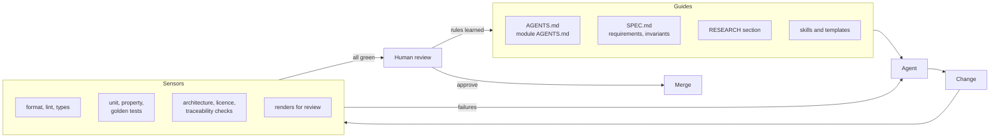

[Index](README.md) · [02. Repository layout →](02-repository-layout.md)

# 01. AI-first principles

**What it means here.** An AI-first code base is built so that a coding agent with no memory of earlier sessions can take any well-defined task, find everything it needs inside the repository, check its own work mechanically, and hand over a change that a person can review in minutes. People own the decisions, the specifications and the final review; agents do most of the writing, testing and routine maintenance.

**What it does not mean.** It does not mean code that nobody reads, generated code that nobody can review, or specifications that replace code. The code and its tests remain the truth; specifications state the contract the code must meet. Every line must still make sense to a machinist-programmer reading it in five years.

## The principles

1. **The repository is the only memory.** Everything an agent needs lives in files: specs, decisions, plans, glossary, gotchas. Nothing important lives only in a chat. When something has to be explained twice, it goes into a file.
2. **Every rule that matters is checked by a machine.** Formatters, linters, type checks, architecture tests, licence checks and traceability checks catch what prose rules only ask for. The size, duplication and dead-code limits of [12](12-lean-code.md) are checked this way (D-139). Written rules are for what no check can express. (Thoughtworks calls these *guides*, which steer the agent before it acts, and *sensors*, which check after it acts.)
3. **Fast, one-command feedback.** `tools/test-one <module>` runs in seconds, `tools/check` in a few minutes. Agents work by iterating on feedback; a slow or unclear loop makes them guess.
4. **Small modules with a written contract.** An agent should be able to work on a module after reading only its `SPEC.md`, the public interfaces of its dependencies and one RESEARCH section. Small, well-bounded modules keep the context small, and a small context gives better results.
5. **Invariants before implementation.** The properties that must always hold (see [RESEARCH 24](../research/24-testing-and-verification.md)) are written as tests before the code. Agents may add tests, never weaken them. Removing a test together with a requirement that a person withdrew is not weakening ([12](12-lean-code.md), section 5).
6. **Deterministic and observable.** The same input gives the same output, bit for bit. Everything runs headless from a command line, and every intermediate result can be written as JSON or drawn as SVG, so agents (and people) can look at geometry instead of guessing.
7. **Boring, consistent code.** One way to do each thing, names from the glossary, small functions, plain data. Agents copy the patterns they see, so the first modules set the standard for everything after them: write and review those with particular care. Boring also means small: no code that no requirement needs ([12](12-lean-code.md)).
8. **People decide, agents propose.** Architecture decisions, new dependencies, public interfaces, tolerances, approved reference outputs and anything touching licences or provenance need a person's approval.
9. **Small, verified changes.** One requirement or one slice of a module per change, with evidence: which commands ran, what they reported, and pictures for geometry changes. The size limits per change, file, function and module are in [12](12-lean-code.md), section 3, and every report ends with a size line.
10. **Provenance is part of the code.** Every algorithm and constant names its public source. No code enters from proprietary or licence-incompatible sources ([09](09-dependencies-licensing-provenance.md)).
11. **Context in layers.** The root `AGENTS.md` is a short map; module `AGENTS.md` files, specs and RESEARCH sections are read only when a task needs them. Loading everything at once makes results worse, not better.
12. **Documentation is maintained like code.** Stale documentation is a bug. CI checks links and cross-references, and a recurring "gardening" task compares docs with the code.

## The harness at a glance

The last arrow matters most: every review comment that would apply again becomes a check, a test or a line in an instruction file.

## Sources

- Anthropic, *Claude Code best practices*: <https://code.claude.com/docs/en/best-practices>
- Anthropic, *Effective context engineering for AI agents* (2025): <https://www.anthropic.com/engineering/effective-context-engineering-for-ai-agents>
- OpenAI, *Harness engineering* (2026): <https://openai.com/index/harness-engineering/>
- B. Böckeler (Thoughtworks), *Harness engineering* (2026): <https://martinfowler.com/articles/harness-engineering.html>, and *Context engineering for coding agents* (2026): <https://martinfowler.com/articles/exploring-gen-ai/context-engineering-coding-agents.html>
- B. Böckeler, *Understanding spec-driven development tools* (2025), for the limits of specs: <https://martinfowler.com/articles/exploring-gen-ai/sdd-3-tools.html>

---

[Index](README.md) · [02. Repository layout →](02-repository-layout.md)
