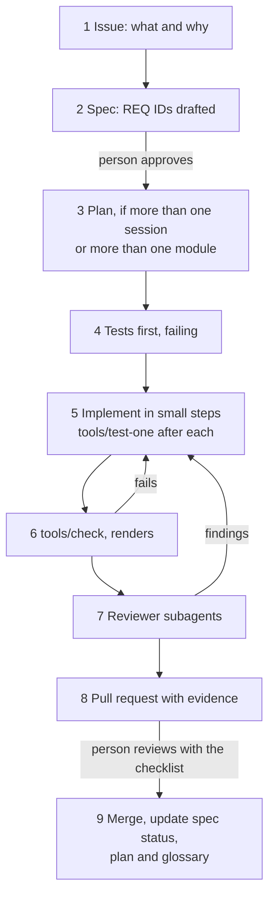

[Index](README.md) · [← 06. Testing and quality gates](06-testing-and-quality-gates.md) · [08. Agent instruction files →](08-agent-instruction-files.md)

# 07. Agent workflow

This is the path of a change from idea to merged code, with the points where a person decides. The goal is to let agents work for long stretches without supervision while keeping every change small enough to review properly.

## Roles

| Role | Who | Responsibilities |
| --- | --- | --- |
| Maintainer | A person | Priorities, spec approval, ADR decisions, reviews, approving golden outputs, licence and provenance questions |
| Implementer | An agent | Tests, code, spec drafts, plan updates, evidence |
| Reviewers | Agents (subagents) | `spec-reviewer`: does the change meet the spec and the research, what edge cases are missing? `test-auditor`: were tests weakened, are invariants covered? `cnc-reviewer`: is the machine output safe? `simplifier`: what could go without breaking a requirement? Every finding carries a class ([12](12-lean-code.md), section 5) |
| Gardener | An agent on a schedule | Broken links, stale plans, requirements without tests, oversized instruction files, glossary drift, size hotspots and modules near their budget |

## The lifecycle

## Task size

- One task fits one agent session and touches one module (plus its tests and docs).
- Non-test code changes stay under 200 lines per pull request: `tools/size-check` reports above 200 and fails above 400 unless the maintainer labels the pull request. Larger work is split in a plan or a feature spec into tasks that each leave the build green.
- Every plan step has a size estimate; at 50 % over it, the agent stops and asks, as for a timebox ([12](12-lean-code.md), section 3).
- Every task report ends with a size line: lines added and removed in `src/`, `tests/`, `tools/` and spikes, and the module's budget used.
- Prefer vertical slices: one requirement fully done (test, code, docs) over a half-finished layer.

## Review findings

- Each finding is *must fix* (breaks a released requirement, an invariant, safety or provenance), *spec gap* (a real risk no released requirement covers) or *nice to have* ([12](12-lean-code.md), section 5).
- Only must-fix findings change the code in the same change. A spec gap becomes a question or a draft requirement; a nice-to-have goes into the plan's backlog.
- The `simplifier` runs on every change over about 100 lines of non-test code and only proposes deletions.
- If a round of fixes grows the non-test diff by more than 30 %, the change lists which finding each addition answers.
- Code may be deleted together with its tests when a person withdraws or changes their requirement.

## Session protocol

**At the start:** read `AGENTS.md` (loaded automatically), the active plan if there is one (its Handover section first, if it has one), the module's `SPEC.md`, `AGENTS.md` and `DECISIONS.md`, and the one RESEARCH section the task needs.

**During the session:** record decisions, Peter's answers, pitfalls and open questions when they happen, in the same commit as the change ([05](05-specs-plans-decisions.md), "Keep the record as you go"). Before changing existing behaviour, look up why it is there ([05](05-specs-plans-decisions.md), "Before changing existing behaviour").

**At the end, always, even when unfinished:** run `tools/check` and record the result, update the plan's progress log (done, next step, open questions), check that every decision of the session is in `DECISIONS.md`, commit the work in progress on the task branch. When a plan or a slice ends, or work stops for longer than a few days, the plan gets a Handover section: what exists, what is in flight, open questions for Peter, how the work ran. The next session, or another agent, must be able to continue from the files alone.

## Questions: who answers

Peter is the domain expert for machining, not for computational geometry or numerics. A question reaches him only when it needs his judgement. Before writing any question, sort it into one of three boxes (D-163):

| Box | Examples | Who answers, and how |
| --- | --- | --- |
| **1. Peter's judgement** | scope; what the user sees or must do; machine and controller behaviour (never guessed); safety; licences and provenance; new dependencies; `modules.yaml` and interfaces between modules; anything that changes an accepted decision (D-nnn, accepted ADR) | Peter, in machining terms (below), at most five per deliverable (D-160) |
| **2. Technical, inside the module** | algorithms, numerics, tolerances inside the module's share, fill rules, edge cases, error codes, internal names; a deviation from the research or the SPEC that a test, a measurement or a cited source supports | The agent decides, marks it "(ours)", records it with its evidence in the module's `DECISIONS.md`, and lists it in the pull request under "Deviations and decisions". Merging the pull request approves it; Peter may still change it in review. |
| **3. Knowledge nobody has at hand** | "is there a proven method for this?", a research text that is silent or wrong and no test settles it | A research request in `docs/research/REQUESTS.md`, answered from Project Spike with sources. It never goes to Peter as a question. |

**Machining terms.** A box 1 question says what happens on the machine or for the user under each option, recommends one, and names the safe default already taken: "A pocket with an island tangent to its wall: with A it is machined, with B the operation stops with an error. Recommended: A." If a question cannot be phrased like that, it is not a box 1 question.

**Never block on a question.** Take the conservative option (the one that cannot gouge, collide or silently drop material), record it as provisional in `DECISIONS.md`, keep working, and flag it. Stop only where every option could harm a part or a machine, or where the box 1 list says so explicitly.

**Still stop at once** when: a test looks wrong or passing it would need a looser tolerance; the same approach has failed three times; the code needs something no requirement covers (propose the requirement instead); a plan step passes its size estimate by 50 %. These go into the plan's progress log, sorted into a box like any other question.

## File references

Every file named in a report, a question, a plan, a pull request, a commit message, a research request or a decision is written as its path relative to the repository root, in backticks: `src/splintercam/geometry2d/SPEC.md`, not "SPEC.md", "the SPEC" or "the plan". Add the section or line where it helps: `src/splintercam/geometry2d/SPEC.md`, "Open questions", or `src/splintercam/geometry2d/kernel/region.cpp:120`. Files outside the repository (Project Spike) are named with their repository and path: Project Spike `DECISIONS.md`. The reader must be able to open the file without searching.

## Human gates

A person must approve: reviewed specs, accepted ADRs, `modules.yaml`, new dependencies, golden output changes, tolerance policy changes, releases, and any change to `LICENSE`, `NOTICE`, CI or agent settings. The settings file denies agents the commands and paths behind these gates ([08](08-agent-instruction-files.md)), and `CODEOWNERS` requires the maintainer's review for them.

## Branches, commits and pull requests

- One branch and one pull request per working session, not per task or plan step (Peter, 2026-10-03). Inside it, one commit per item, each with its record (tests, SPEC, `DECISIONS.md`), so the maintainer can review commit by commit. Branch names name the session's main work: `feat/geometry2d-offset-arcs`, `fix/post-arc-rounding`.
- Small code changes go into the session's pull request: up to about 100 lines of non-test code with no new or changed algorithm. A change gets a pull request of its own when it is a new or changed algorithm (it needs the spec-reviewer round), when it is over about 100 lines of non-test code, or when the session's pull request would pass the 400-line limit of [12](12-lean-code.md), section 3.
- At most two pull requests open at a time. A new branch starts from `main` after the previous merge; never stack pull requests (merging with "delete branch" closes or retargets the next one).
- Why: on 2026-10-03 six pull requests opened in parallel all appended to the SPEC change log and `DECISIONS.md`, so each merge left the others in conflict or out of date with `main`.
- Commit messages follow Conventional Commits and name the requirement: `feat(geometry2d): true-arc offsets (REQ-OFF-006)`.
- AI-assisted commits carry the agent's attribution trailer (for example `Co-Authored-By:`), and the human who submits the work signs off (Developer Certificate of Origin, `Signed-off-by:`), taking responsibility for it.
- The pull request uses [.github/PULL_REQUEST_TEMPLATE.md](../../.github/PULL_REQUEST_TEMPLATE.md): requirements covered, commands run with results, renders, tests added or changed (and why), golden changes, dependencies, sources used. The maintainer reviews with [docs/templates/REVIEW-CHECKLIST.md](../templates/REVIEW-CHECKLIST.md).

## Several agents in parallel

- Give each agent its own working copy (a git worktree) and its own branch.
- Assign different modules or different strategies; the architecture keeps strategies independent for exactly this reason.
- Shared files (`modules.yaml`, the glossary, schemas) are changed in a small pull request merged before the work that needs them.

## Starting the project

The first modules become the examples every later agent imitates. After the stack test app (its plan 0001, in the test app's own repository), write `foundation` and the first part of `geometry2d` with the most human attention: review every line, adjust the language appendix of [04](04-code-conventions.md) where practice differs from the plan, and add each lesson to `AGENTS.md` or a check. Before the first of them, set up `tools/size-check`, the linter limits, the `simplifier` and the finding classes ([12](12-lean-code.md), section 8). Only then hand out larger tasks.

## Things that go wrong

- An agent running for hours without a checkpoint: require a plan update and a green `tools/check` at least every hour of work.
- Large pull requests: split them; a review that cannot be done properly is not a review.
- "Fixing" the test instead of the code: caught by the `test-auditor` and the rules in [06](06-testing-and-quality-gates.md).
- Vague tasks ("improve pocketing"): turn them into requirements first.
- Review fixes that only add: findings are classed, and only must-fix findings change code.
- Throwaway code that grows: probes follow [12](12-lean-code.md), section 6.
- Stuffing the context: pasting the whole research guide into a prompt makes results worse. Point to the one section that matters.

---

[Index](README.md) · [← 06. Testing and quality gates](06-testing-and-quality-gates.md) · [08. Agent instruction files →](08-agent-instruction-files.md)
